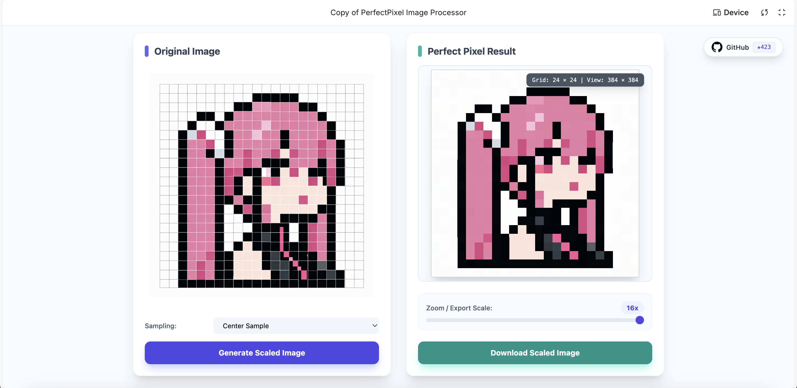

# Perfect Pixel Web Demo

> **Auto detect and Get perfect Pixel art**

Standard scaling often fails to sample AI-generated pixel art due to inconsistent sizes and non-square grids. 

This tool automatically detects the optimal grid and delivers perfectly aligned, pixel-perfect results.

**This is the official web demo of [perfect-pixel](https://github.com/theamusing/perfectPixel) library.**

*built with google ai studio*

